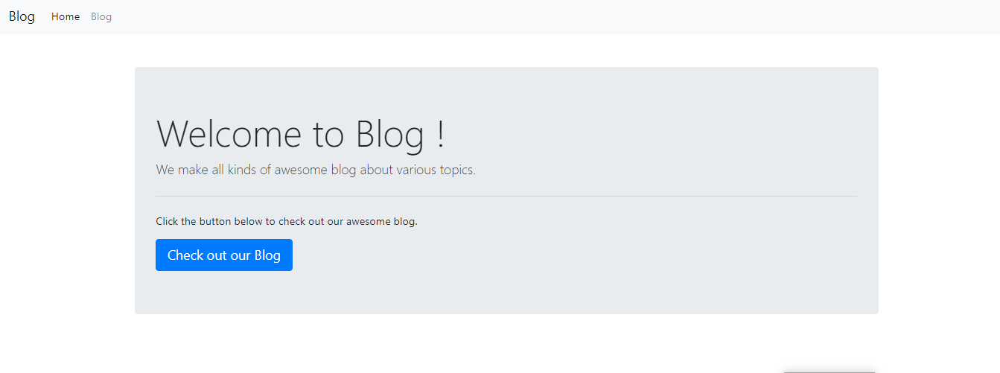
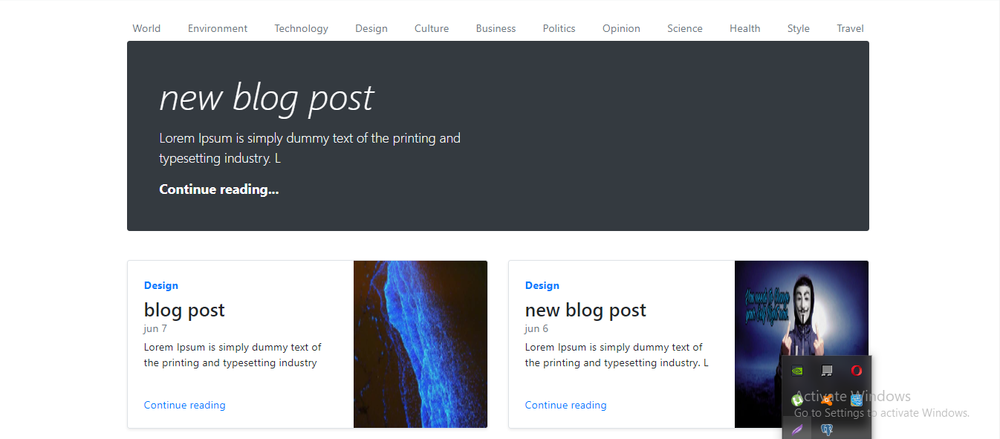
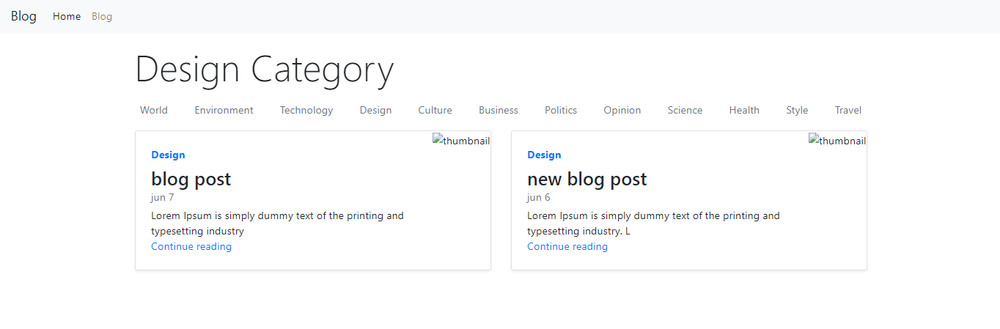

# django-react-blog

In order to test out this project, follow these steps:

- clone the repository
- in the frontend folder, run: npm install, this will install the required frontend packages
- in the frontend folder, run: npm run build, this will make a build folder and copy it into the backend folder
- in the backend folder, run: python3 -m venv venv
- then activate the virtual environment
- in the backend folder, run: pip install -r requirements.txt
- in backend/backend/settings.py, under DATABASES, set the PASSWORD field to your database password

### Screenshots of the project page

## home page

## Blog page

## categories page

